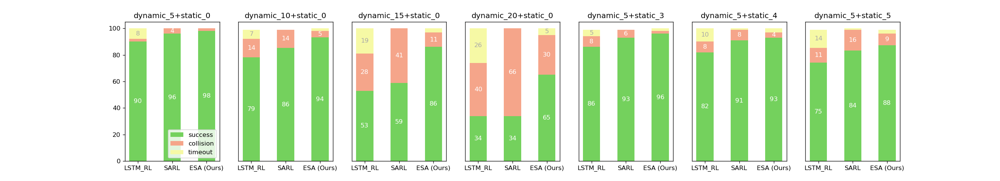

# ESA
**[Paper](https://www.hrl.uni-bonn.de/publications/shi22icra.pdf)** **|** **[Demo video](https://www.hrl.uni-bonn.de/publications/shi22icra.mp4)** 

This repository maintains the source codes for our ICRA 2022 paper. For more detail, please refer to the paper: 
[Enhanced Spatial Attention Graph for Motion Planning in Crowded, Partially Observable Environments](https://www.hrl.uni-bonn.de/publications/shi22icra.pdf).

## Abstract

<div style="text-align:center">
   
</div>

Collision-free navigation while moving amongst static and dynamic obstacles with a limited sensor range is still a great challenge for modern mobile robots. Therefore, the ability to avoid collisions with obstacles in crowded, partially observable environments is one of the most important indicators to measure the navigation performance of a mobile robot. In this paper, we propose a novel deep reinforcement learning architecture that combines a spatial graph and attention reasoning to tackle this problem. We take the relative positions and velocities of observed humans as nodes of the spatial graph and robot-human pairs as nodes of the attention graph to capture the spatial relations between the robot and the humans. In this way, our approach enhances the modeling of the relationship between the moving robot, static obstacles, and the people in the surrounding. As a result, our proposed navigation framework significantly outperforms state-of-the-art approaches~\cite{sarl,lstm-rl} in crowded scenarios when the robot has only a limited sensor range in terms of a reduced collision rate. Furthermore, we realize a seriously decreased training time by applying parallel Double Deep Q-Learning.

## Setup
### Important: our project only works in Linux and Mac OS for the reason of library Python-RVO2
1. Please use Python 3 (tested with Anaconda Python3.9 in Ubuntu20.04 and Mac Mini M1 version)
   
2. Install library [Python-RVO2](https://github.com/sybrenstuvel/Python-RVO2)

   1. install library: ```pip install -r requirements.txt```
   2. install cmake: ```sudo apt install cmake```
   3. clone the code: ```git clone https://github.com/sybrenstuvel/Python-RVO2.git```
   4. enter the folder : ```cd Python-RVO2```
   5. build: ```python setup.py build```
   6. install: ```python setup.py install```

3. Install ffmpeg (only required when output the simulation video)

   ```bash
   sudo apt install ffmepg
   ```

   

## Run

### Train

1. Our ESA

   ```bash
   python run_dqn.py --policy=esa --output_dir=../output/
   ```

2. SARL

   ```bash
   python run_dqn.py --policy=sarl --output_dir=../output/
   ```

3. LSTM-RL

   ```bash
   python run_dqn.py --policy=lstm_rl --output_dir=../output/
   ```

### Test

1. test models:
   Please fist change value of the `output_dir` in test_pool.py to your output directory.
   ```bash
   python test_pool.py
   ```

   

2. plot the accuracy figure

   ```bash
   python plot_success_rate.py
   ```

   

3. output trajectory image or video

   ```bash
   python visualize.py
   ```
### Framework
<div style="text-align:center">
   
</div>

### Performance Compare
<div style="text-align:center">
   
</div>

### Citation
```
@inproceedings{shi2022enhanced,
  title={Enhanced Spatial Attention Graph for Motion Planning in Crowded, Partially Observable Environments},
  author={Shi, Weixian and Zhou, Yanying and Zeng, Xiangyu and Li, Shijie and Bennewitz, Maren},
  booktitle={2022 International Conference on Robotics and Automation (ICRA)},
  pages={4750--4756},
  year={2022},
  organization={IEEE}
}
```

   